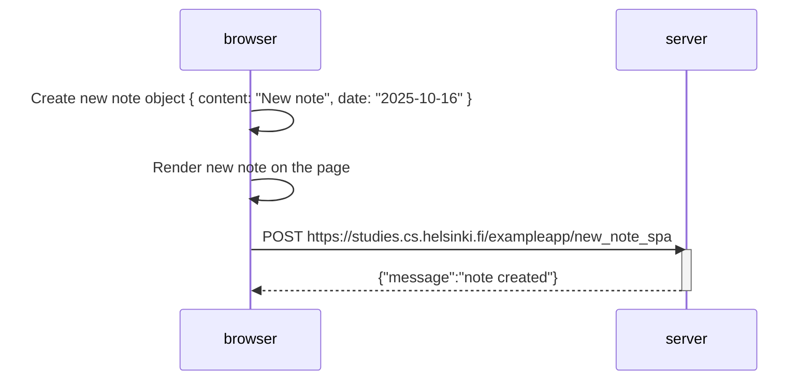

```mermaid
sequenceDiagram
    participant browser
    participant server

    browser->>browser: Create new note object { content: "New note", date: "2025-10-16" }
    browser->>browser: Render new note on the page

    browser->>server: POST https://studies.cs.helsinki.fi/exampleapp/new_note_spa
    activate server
    server-->>browser: {"message":"note created"}
    deactivate server
```